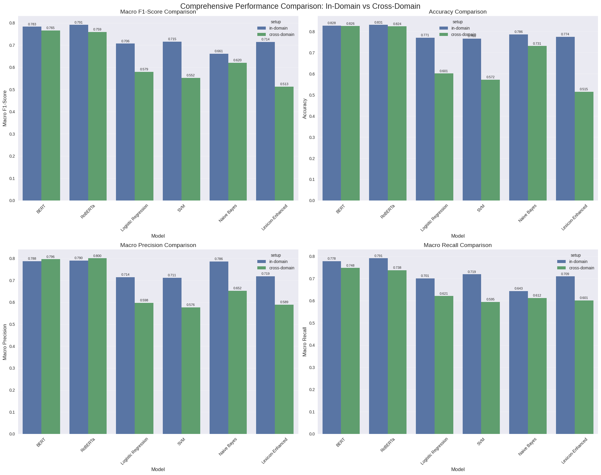
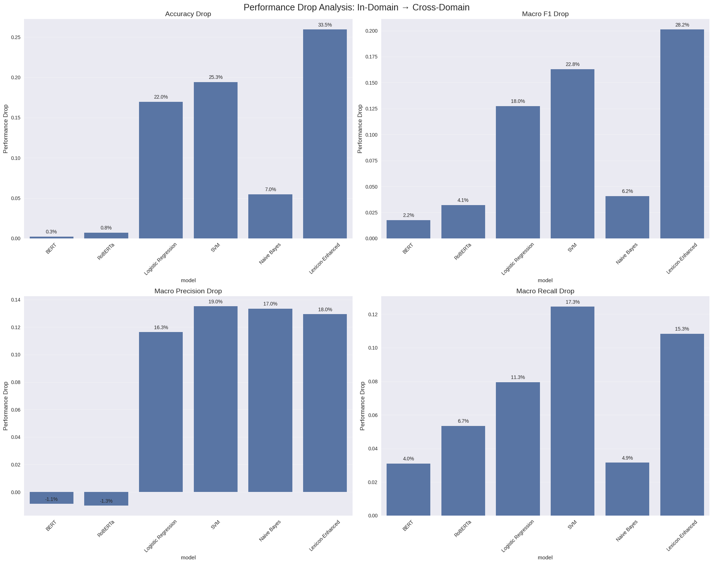
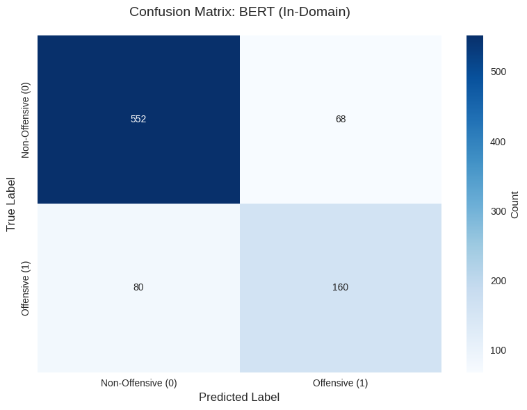

# Hate Speech Detection - Cross-Domain Analysis

> **Content Warning**: This project analyses offensive language examples for research purposes.

Compares transformer-based (BERT, RoBERTa) and classical ML (Logistic Regression, SVM, Naive Bayes, Lexicon-Enhanced) approaches to hate speech detection across two experimental settings:

- **In-domain**: train on OLID, test on OLID
- **Cross-domain**: train on HASOC, test on OLID (measures generalisation)

---

## Datasets

| Dataset | Split  | Samples | Offensive % |
|---------|--------|---------|-------------|
| OLID    | train  | 5,852   | 38.6%       |
| OLID    | test   | 860     | 27.9%       |
| HASOC   | train  | 5,852   | 38.6%       |

Labels: `0` = non-offensive, `1` = offensive.  
CSV files are stored in [`data/`](data/).

---

## Requirements

- Python 3.11+
- [uv](https://docs.astral.sh/uv/) - `pip install uv` or follow the [uv install guide](https://docs.astral.sh/uv/getting-started/installation/)
- A CUDA-capable GPU is strongly recommended for the transformer models (BERT, RoBERTa)

---

## Installation

```bash
# 1. Clone the repo
git clone <repo-url>
cd hate-speech-detection

# 2. Install all dependencies from the lock file
uv sync

# 3. Install the hate_speech package in editable mode
uv pip install -e .
```

---

## Usage

### Run the full pipeline (both experiments)

```bash
uv run python main.py
```

Or using the installed CLI script:

```bash
uv run hate-speech-run
```

### Run a single experiment

```bash
# In-domain only (OLID → OLID)
uv run hate-speech-indomain
# or
uv run python scripts/run_in_domain.py

# Cross-domain only (HASOC → OLID)
uv run hate-speech-crossdomain
# or
uv run python scripts/run_cross_domain.py
```

---

## Outputs

All outputs are written to `outputs/` (gitignored, created at runtime):

| Path | Contents |
|------|----------|
| `outputs/results/results.csv` | Per-model metrics for all experiments |
| `outputs/results/performance_drops.csv` | Performance drop from in-domain to cross-domain |
| `outputs/figures/confusion_matrix_*.png` | Confusion matrix heatmaps (one per model × setup) |
| `outputs/figures/performance_comparison_*.png` | Bar charts per metric |
| `outputs/figures/performance_drop_*.png` | Drop bar charts per metric |
| `outputs/figures/comprehensive_performance_comparison.png` | 2×2 overview chart |

---

## Project Structure

```
hate-speech-detection/
├── pyproject.toml            # project metadata and dependencies
├── uv.lock                   # locked dependency graph
├── .python-version           # Python 3.11
├── main.py                   # runs both experiments end-to-end
│
├── data/                     # CSV datasets (tracked in git)
│   ├── olid-train-small.csv
│   ├── olid-test.csv
│   └── hasoc-train.csv
│
├── scripts/
│   ├── run_in_domain.py      # standalone in-domain runner
│   └── run_cross_domain.py   # standalone cross-domain runner
│
└── src/hate_speech/
    ├── config.py             # all paths, hyperparameters, lexicon
    ├── data/
    │   ├── loader.py         # load_data(), explore_data()
    │   └── preprocessor.py   # preprocess_text(), preprocess_dataset()
    ├── features/
    │   ├── tfidf.py          # create_tfidf_features()
    │   └── lexicon.py        # create_lexicon_features()
    ├── models/
    │   ├── classical.py      # Logistic Regression, SVM, Naive Bayes
    │   ├── transformer.py    # BERT, RoBERTa via simpletransformers
    │   └── hybrid.py         # TF-IDF + lexicon stacked model
    ├── evaluation/
    │   ├── metrics.py        # comprehensive_evaluation(), compute_performance_drops()
    │   ├── visualization.py  # plot_confusion_matrix(), bar charts
    │   └── analysis.py       # detailed_error_analysis(), analyze_dataset_differences()
    └── experiments/
        ├── in_domain.py      # orchestrates OLID → OLID
        └── cross_domain.py   # orchestrates HASOC → OLID
```

---

## Results Showcase

### Model performance - in-domain vs cross-domain



Transformers (BERT, RoBERTa) lead on macro F1 in both settings. Classical models degrade sharply in cross-domain, while transformer representations generalize better.

### Performance drop when switching domains (HASOC → OLID)



The lexicon-enhanced and SVM models suffer the largest accuracy drops (~20–30 pp), confirming that surface-level features are highly domain-specific.

### BERT confusion matrix - in-domain



---

## Key Design Decisions

- **Central config** - all paths and hyperparameters live in `src/hate_speech/config.py`. Change them once and the change propagates everywhere.
- **`src/` layout** - prevents accidental import of the uninstalled package and follows modern Python packaging conventions.
- **Automatic GPU/CPU fallback** - the transformer module detects CUDA availability and disables FP16 / multiprocessing when running on CPU.
- **Modular experiments** - `experiments/in_domain.py` and `experiments/cross_domain.py` are fully self-contained; you can run either independently or both via `main.py`.
